<p align="center">
  
</p>

# Deep Harbor CRM
## Quick Note on configuration (or lack thereof)
The system makes use of a lot of `config.ini` files in various places. These files are used to configure database connections, service endpoints, and other settings. There are a number of parameters that Deep Harbor uses that require things like an Active Directory server, an RFID controller, and so forth. The default `config.ini` files that are included with the code are meant for development purposes only and will need to be modified to reflect your actual environment.

The portals (DHAdminPortal and DHMemberPortal) require a `SECRET_KEY` for CSRF protection and session security. Set it via the `DH_SECRET_KEY` environment variable or add a `[flask] secret_key` entry to each portal's `config.ini`. Generate one with:
```bash
python -c "import secrets; print(secrets.token_hex(32))"
```
In the dev environment this is handled automatically — you don't need to do anything.

Also note that Pumping Station One uses [Azure B2C](https://learn.microsoft.com/en-us/azure/active-directory-b2c/overview) for identity management; if you are not using Azure B2C, you will need to modify the authentication and authorization code in both the DHAdminPortal and DHMemberPortal components to reflect your identity management system.

> **Looking to set up a dev environment?** See [DEV_SETUP.md](DEV_SETUP.md) — it handles config files, seed data, and auth bypass automatically. The guide below is for production deployments.

## Purpose
The Deep Harbor CRM was written to support membership at [Pumping Station: One](https://pumpingstationone.org). It's meant to be performant and flexable, subscribing to the concept of _"You don't know what you don't know."_ What this means is that the system is designed to be easy to extend and modify to fit new situations with minimal changes.
## General Design
To facilitate easy changes, Deep Harbor is built around the concept of _web services_. Services are grouped around areas of responsibility; specific functionality is encapsulated within a set of service calls that provide only what is necessary to perform tasks related to what the service is responsible for. For example, there is a "worker" service called `DH2AD` (all Deep Harbor comppnents are prefixed with `DH` or `dh_`) that exposes a set of web service API that allow Deep Harbor data to be sent to Active Directory.
## Components
Deep Harbor is comprised of the following components:
* DHAdminPortal
This is a front-end website that is used by administrators, authorizers (folks who are tasked with teaching other members how to use certain equipment), and any other person who has been granted `MEMBER_CHANGE_ACCESS`.
* DHMemberPortal
This is the front end that the member or prospective member interacts with. It is here that they create an account, set up payments, configure access (i.e. RFID) tags, and other individual-specific tasks that are not related to administration (for example, individual members cannot authorize themselves on equipment).
* DHDispatcher
This program does not expose web services but instead listens for notifications from the Postgres database and invokes the appropriate service based on the changed data. It does not care what is the origin of the changed data but merely that some other system needs to be informed that some change has, in fact, happened.

The following components are "business services" insofar as they are responsible for performing whatever tasks are necessary based on the change order from the DHDispatcher.

* DHAccess
Handles all access-specific tasks. At Pumping Station One this is RFID-based and is used to control door access. Note that DHAccess itself does not have any knowledge of RFID systems but rather gathers all the relevant information to complete the task (in this case, retrieving RFID tags from the database) and passing that to `DH2RFID` (described below) to perform the actual work.
* DHAuthorizations
Pumping Station One's equipment policy is that a member must be authorized before they are allowed to use tools, especially complex and potentially dangerous ones. Authorization provides two purposes: to ensure the member has sufficient knowledge to use a particular tool, and in certain cases, allow access to the tool's computer (via Active Directory) so they can actually use it.

&nbsp;&nbsp;&nbsp;&nbsp;&nbsp;&nbsp;&nbsp;&nbsp;&nbsp;The DHAuthorizations service performs whatever tasks are necessary to configure authorizations for a particular member in whatever system is necessary to be configured to allow access to the tool (for example, invoking `DH2AD` to put the member in a certain OU so they can log into the computer that controls the tool).
* DHIdentity
Anything that might relate to a change of name, nickname, or other identifying component is handled by DHIdentity.
* DHStatus
Change of status (membership level, etc.) is handled bny this service.

The following components are "worker services" in that they perform whatever low-level functionality is necessary to accomplish the task. Worker services do not have any business logic nor do they communicate with the Deep Harbor database; all relevant components are sent to the worker service and the worker service's only task is to interface to whatever system they work with.

* DH2AD
This service manipulates a member's information within Active Directory.
* DHADController
This service interfaces with the Active Directory controller to add users, change authorizations (via OUs), and other Active-Directory-centric tasks.
* DH2RFID
This service adds and removes RFID tags from the controller database to either allow or deny access to the premises.
* DHRFIDController
This service interfaces with the RFID controller to add and remove RFID tags as necessary.

DH2ADController and DHRFIDController are examples of worker services that interface with external systems on the local network. Because the other containers do not have access to the local network, these worker services are necessary to perform the actual work of interfacing with those systems. They are called by their respective worker services (DH2AD and DH2RFID) to perform the actual work via shared volumes.

* WF2DH
This service receives webhook calls from Waiver Forever when a waiver is signed. It stores the waiver information in the Deep Harbor database in the `waivers` table. The idea is that assuming the person signing the waiver wants to become a member, the waiver information is already in the database when they go to sign up via the DHMemberPortal.

## Directory Structure
* `pg/`: Contains PostgreSQL database initialization scripts and configuration files.
* `code/DHAdminPortal/`: Source code for the administrative web portal.
* `code/DHMemberPortal/`: Source code for the member-facing web portal.
* `code/DHDispatcher/`: Source code for the dispatcher service that listens for database notifications.
* `code/services/DHAccess/`: Source code for the access management service.
* `code/services/DHAuthorizations/`: Source code for the authorizations management service.
* `code/services/DHIdentity/`: Source code for the identity management service.
* `code/services/DHStatus/`: Source code for the status management service.
* `code/workers/DH2AD/`: Source code for the Active Directory integration service.
* `code/workers/DH2RFID/`: Source code for the RFID integration service.
* `code/workers/DHADController/`: Source code for the Active Directory controller interface.
* `code/workers/DHRFIDController/`: Source code for the RFID controller interface.
* `pg/`: Contains all the PostgreSQL-based files including SQL schema definitions and database-related scripts.
* `tools/`: Scripts and other files used for development and maintenance tasks (e.g., database migrations, backups).
* `code/utilities`: Extra tools that interact with the system in some way.
* `code/WF2DH/`: Source code for the Waiver Forever webhook integration service.

### Additional Files
These files are located in the root directory of the Deep Harbor CRM project:

* `docker-compose.yaml`: Docker Compose configuration file to set up the entire Deep Harbor CRM environment
* `start_dh.sh`: Script to start all Deep Harbor components.
* `stop_dh.sh`: Script to stop all Deep Harbor components.
* `reset_for_restart.sh`: Script to reset the Deep Harbor environment for a fresh start.
* `README.md`: This file, providing an overview and instructions for the Deep Harbor CRM project.
* `nginx.conf`: Nginx configuration file for routing requests to the appropriate Deep Harbor components.


## Production Deployment

> For local development, see [DEV_SETUP.md](DEV_SETUP.md) instead. The dev setup handles all of this automatically.

### Prerequisites

- **Docker** and **Docker Compose** (v2.24.0+, with `docker compose` syntax)
- **Git**
- Access to the external services you plan to integrate (Azure B2C, Active Directory, RFID hardware, Stripe, Mailgun — see step 5)

### Step 1: Clone and Create Config Files

```bash
git clone https://github.com/pumpingstationone/deepharbor.git
cd deepharbor
```

Every service needs a `config.ini` file. Start by copying the examples:

```bash
find code -name "config.ini.example" -exec sh -c \
  'for f; do cp -n "$f" "${f%.example}"; done' _ {} +
```

Config files are gitignored and will never be committed. Each one needs to be edited with production values as described in the steps below.

### Step 2: Generate Secrets

Several services require unique secret keys. Generate each one with:

```bash
python -c "import secrets; print(secrets.token_hex(32))"
```

| Secret | Where to set it | Config file(s) |
|--------|----------------|----------------|
| Flask SECRET_KEY | `DH_SECRET_KEY` env var **or** `[flask] secret_key` in config.ini | `code/DHMemberPortal/config.ini`, `code/DHAdminPortal/config.ini` |
| DHService OAuth2 key | `[oauth2] secret_key` | `code/DHService/config.ini` |
| DH2MG OAuth2 key | `[oauth2] secret_key` | `code/external/DH2MG/config.ini` |
| Database password | `[Database] password` + `POSTGRES_PASSWORD` in docker-compose.yaml | All services that connect to the database |

**Important:** Change the default database password (`dh`) in both `docker-compose.yaml` (the `POSTGRES_PASSWORD` env var on the `db` service) and in every service's `config.ini` `[Database] password` field.

### Step 3: Configure Service-to-Service Auth

Each portal and external service authenticates to DHService using OAuth2 client credentials. Generate a unique `client_secret` for each and set the matching values in DHService's config.

| Service | Config section | Keys to set |
|---------|---------------|-------------|
| DHMemberPortal | `[dh_services]` | `client_name`, `client_secret`, `api_base_url` |
| DHAdminPortal | `[dh_services]` | `client_name`, `client_secret`, `api_base_url` |
| ST2DH (Stripe) | `[dh_services]` | `client_name`, `client_secret`, `api_base_url` |
| DH2MG (Mailgun) | `[dh_services]` in DHStatus config | `client_name`, `client_secret`, `api_base_url` |

Set `api_base_url` to `http://gateway/dh/service` (the internal nginx gateway route) for services on the Docker bridge network, or `http://localhost/dh/service` for services using host networking.

### Step 4: Configure Azure B2C Authentication

Both portals require Azure B2C for user authentication. Fill in the `[b2c]` section in each portal's `config.ini`:

| Key | Description |
|-----|-------------|
| `TENANT_NAME` | Your Azure B2C tenant name |
| `CLIENT_ID` | App registration client ID from Azure portal |
| `CLIENT_SECRET` | App registration client secret |
| `ENDPOINT` | Application ID URI |
| `SIGNUPSIGNIN_USER_FLOW` | Name of your sign-up/sign-in user flow |
| `EDITPROFILE_USER_FLOW` | Name of your profile editing user flow |
| `RESETPASSWORD_USER_FLOW` | Name of your password reset user flow |

DH2AD and DHADController also need Azure B2C config in their `[azure_b2c]` section (`tenant_name`, `tenant_id`, `client_id`, `client_secret`, `extensions_app_id`).

If you are not using Azure B2C, you will need to modify the authentication code in both portals.

### Step 5: Configure External Services

#### Active Directory

Set these in `code/workers/DH2AD/config.ini` and `code/workers/DHADController/config.ini`:

| Section | Key | Description |
|---------|-----|-------------|
| `[active_directory]` | `domain_name` | AD domain (e.g., `corp.example.com`) |
| `[active_directory]` | `server_ip` | AD server IP address |
| `[active_directory]` | `username` | Service account username |
| `[active_directory]` | `password` | Service account password |
| `[active_directory]` | `base_dn` | Base DN (e.g., `dc=corp,dc=example,dc=com`) |
| `[active_directory_groups]` | `member_DN` | OU where new users are created |
| `[active_directory_groups]` | `tool_base_DN` | Base DN for tool access groups |

#### RFID Hardware

Set in `code/workers/DHRFIDReader/config.ini` and `code/utilities/RFID2DB/config.ini`:

| Key | Description |
|-----|-------------|
| `BOARD_IP` | RFID reader hardware IP address |
| `BOARD_PORT` | RFID reader port (typically `60000`) |
| `BOARD_SERIAL_NUMBER_AS_INT` | RFID reader serial number (as integer) |

#### Stripe

Set in `code/external/ST2DH/config.ini`:

| Key | Description |
|-----|-------------|
| `[stripe] api_key` | Stripe API key |
| `[stripe] signing_secret` | Stripe webhook signing secret |

Configure Stripe to send webhooks to `https://<your-domain>/dh/wf2dh/`.

#### Mailgun

Set in `code/external/DH2MG/config.ini`:

| Key | Description |
|-----|-------------|
| `[mailgun] api_key` | Mailgun API key |
| `[mailgun] url` | Mailgun domain URL |
| `[mailgun] from_name` | Sender display name |
| `[mailgun] from_email` | Sender email address |

#### Waiver Forever

Configure Waiver Forever to send webhooks to `https://<your-domain>/dh/wf2dh/`. No credentials are needed in WF2DH's config — it only needs database access.

### Step 6: Start the Stack

```bash
./start_dh.sh
```

This script sets the `GIT_VERSION` build arg and runs `docker compose up -d`. To manage the stack:

```bash
./stop_dh.sh              # Stop all containers and remove volumes
./reset_for_restart.sh    # Full reset: stop, prune images, restart
```

Verify everything is running:

```bash
docker compose ps
docker compose logs -f     # Watch logs for startup errors
```

### Step 7: Post-Deployment Verification

- [ ] All containers show as healthy in `docker compose ps`
- [ ] Member Portal login works via Azure B2C
- [ ] Admin Portal login works via Azure B2C
- [ ] Creating a test member triggers the dispatcher pipeline (check DHDispatcher logs)
- [ ] RFID tag changes propagate to the RFID controller
- [ ] AD account creation works for new members
- [ ] Stripe webhooks are received by ST2DH
- [ ] Monitor logs for the first 24 hours: `docker compose logs -f`

### Not Yet Documented

The following production topics are not yet covered in this guide:

- **SSL/TLS termination** — how to set up HTTPS in front of the stack
- **Reverse proxy setup** — external nginx/Caddy configuration for production domains
- **Backup and restore** — database backup procedures and disaster recovery
- **Monitoring and alerting** — beyond the built-in Grafana dashboards
- **DNS and domain configuration** — mapping your domain to the stack